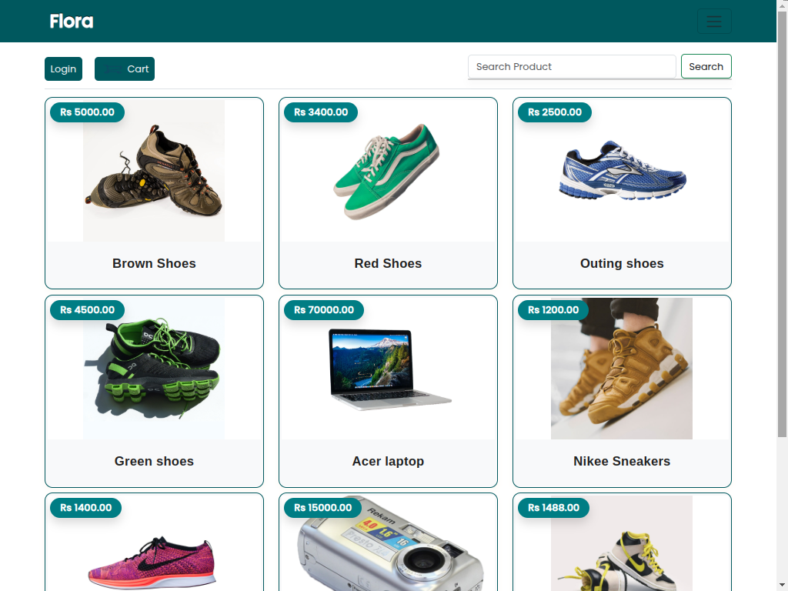
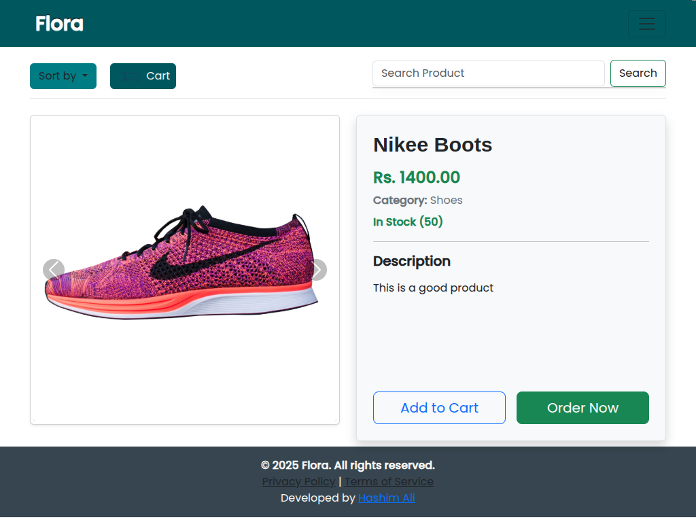
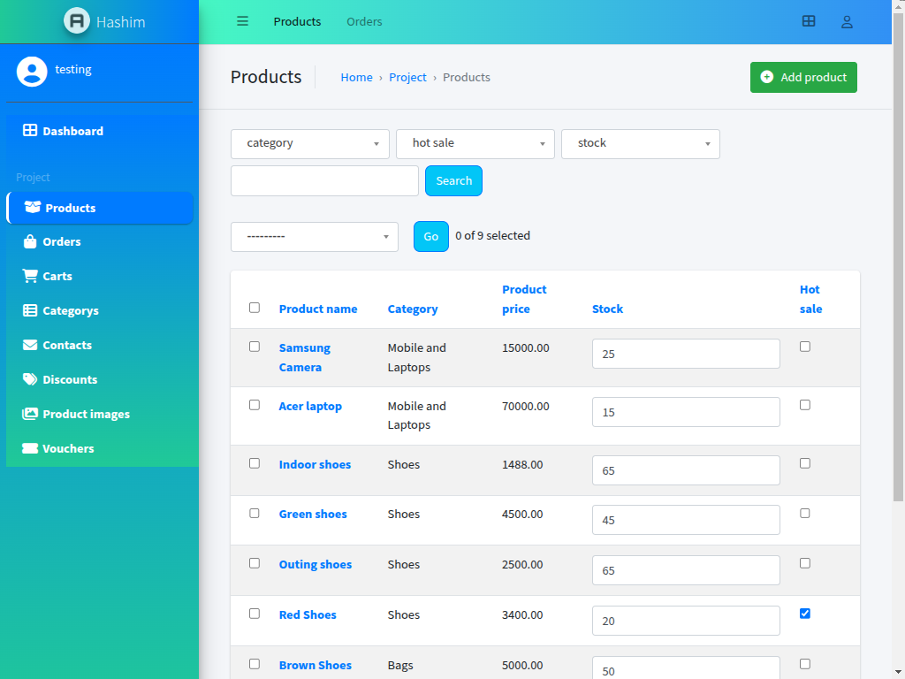
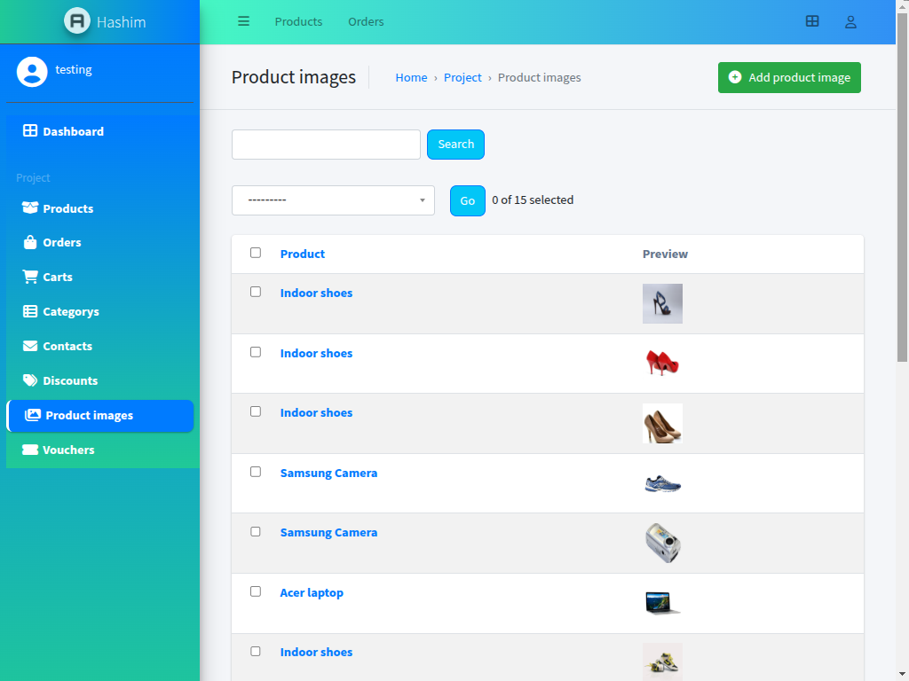

# 🌿 Flora | E-Commerce Shop  

Flora is a **fully functional, end-to-end e-commerce platform** specializing in fashion products.  
Designed and developed as a **solo project**, it demonstrates a complete product lifecycle—from user interaction to administrative control—powered by **Django** on the backend and hosted seamlessly on **Vercel**.  

Currently in its **alpha release**, Flora is open for public exploration and testing.  

🔗 **Live Store:** [shop-amber-nine-46.vercel.app](https://shop-amber-nine-46.vercel.app)  
🔐 **Admin Panel:** [shop-amber-nine-46.vercel.app/admin/](https://shop-amber-nine-46.vercel.app/admin/)  


## 📸 Screenshots

### Homepage


### Product Page


## 🎥 Admin Panel


## 🎥 Admin Panel



📂 **Admin Credentials:**  

Username: testing
Password: testing123

> Anyone can log in and explore the admin interface to understand how products, orders, users, and more are managed.

---

## ✨ Core Features  

### ✅ User Authentication & Authorization
- Secure registration and login system  
- Personalized dashboards  
- Only authenticated users can place orders or manage carts  

### 🛍️ Dynamic Product Catalog
- Categorized and filterable product listings  
- Sorting options (price, popularity, latest, etc.)  
- Responsive product cards with real-time rendering  

### 🔍 Live Search (Instant Search)
- **AJAX-powered live search**  
- Returns suggestions instantly without reloading  
- Major UX boost for larger catalogs  

### 🛒 Shopping Cart & Order Management
- Add, remove, or update product quantities in real-time  
- Place orders and get confirmation  
- Track order status from dashboard  
- Cart data persists for logged-in users  

### 🧾 Rich Admin Panel (Django Jazzmin)
- Customized Jazzmin interface  
- Admins can:  
  - Add/edit/delete products  
  - Manage orders and customer data  
  - Update categories and tags  
  - View analytics dashboard  

### 📱 Responsive Design
- Fully mobile-optimized layout  
- Flexible grid-based system  
- Smooth performance with optimized assets  

### 🔍 SEO Optimization
- Dynamic meta tags and product-specific descriptions  
- Clear semantic HTML and fast load times  

---

## 🧱 Technology Stack  
- **Backend:** Django (Python)  
- **Frontend Rendering:** Django Templates    
- **Admin Interface:** Django Jazzmin (customized)  
- **Hosting:** Vercel  

---

## 🚧 Challenges & Solutions  

**Challenge:** Implementing a fast, user-friendly live search that scales with many products.  
- **Solution:** AJAX + optimized server-side filtering for instant, reload-free responses.  

Other solutions:  
- SEO improvements in Django  
- Scalable product management system  
- Balancing mobile responsiveness with feature-rich UI  

---

## 📌 Why Flora Matters  
Flora demonstrates **end-to-end e-commerce development skills**, covering:  
- UX & UI design  
- Secure backend logic  
- Dynamic admin dashboards  
- SEO-friendly development  
- Scalable database/product management  
- Full deployment pipeline  

---

## ⚙️ Installation (Local Setup)  

1. Clone the repo:
   ```bash
   git clone https://github.com/yourusername/flora.git
   cd flora

    Create a virtual environment:

python -m venv venv
source venv/bin/activate   # Linux/Mac
venv\Scripts\activate      # Windows

Install dependencies:

pip install -r requirements.txt

Create a .env file:

SECRET_KEY=your_secret_key
DEBUG=True
DATABASE_URL=sqlite:///db.sqlite3

Run migrations:

python manage.py migrate

Start server:

    python manage.py runserver

🚀 Deployment

    Deployed seamlessly on Vercel

    Requires requirements.txt & vercel.json

    Environment variables must be added to Vercel dashboard

🤝 Contributing

Contributions and suggestions are welcome! Please open an issue or submit a pull request.
📜 License

MIT License
