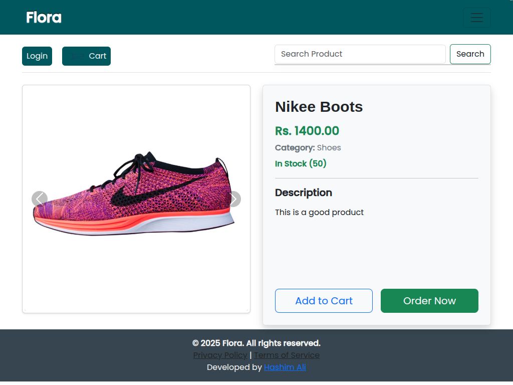

# 🌿 Flora | E-Commerce Shop

**Flora** is a **fully functional, end-to-end e-commerce platform** specializing in fashion products.
Designed and developed as a **solo project**, it demonstrates a complete product lifecycle—from user interaction to administrative control—powered by **Django** on the backend and hosted seamlessly on **Vercel**.

Currently in its **alpha release**, Flora is open for public exploration and testing.

🔗 **Live Store:** [shop-amber-nine-46.vercel.app](https://shop-amber-nine-46.vercel.app)
🔐 **Admin Panel:** [shop-amber-nine-46.vercel.app/admin/](https://shop-amber-nine-46.vercel.app/admin/)

---

## 📸 Screenshots

### Homepage


### Product Page



### Admin Panel


---

## 📂 Admin Credentials

```
Username: testing
Password: testing123
```

> Anyone can log in and explore the admin interface to understand how products, orders, users, and more are managed.

---

## ✨ Core Features

### ✅ User Authentication & Authorization

* Secure registration and login system
* Personalized dashboards
* Only authenticated users can place orders or manage carts

### 🛍️ Dynamic Product Catalog

* Categorized and filterable product listings
* Sorting options (price, popularity, latest, etc.)
* Responsive product cards with real-time rendering

### 🔍 Live Search (Instant Search)

* **AJAX-powered live search**
* Returns suggestions instantly without reloading
* Major UX boost for larger catalogs

### 🛒 Shopping Cart & Order Management

* Add, remove, or update product quantities in real-time
* Place orders and get confirmation
* Track order status from dashboard
* Cart data persists for logged-in users

### 🧾 Rich Admin Panel (Django Jazzmin)

* Customized Jazzmin interface
* Admins can:

  * Add/edit/delete products
  * Manage orders and customer data
  * Update categories and tags
  * View analytics dashboard

### 📱 Responsive Design

* Fully mobile-optimized layout
* Flexible grid-based system
* Smooth performance with optimized assets

### 🔍 SEO Optimization

* Dynamic meta tags and product-specific descriptions
* Clear semantic HTML and fast load times

---

## 🧱 Technology Stack

* **Backend:** Django (Python)
* **Frontend Rendering:** Django Templates
* **Admin Interface:** Django Jazzmin (customized)
* **Media Storage:** Cloudinary
* **Hosting:** Vercel

---

## 🚧 Challenges & Solutions

**Challenge:** Implementing a fast, user-friendly live search that scales with many products.

* **Solution:** AJAX + optimized server-side filtering for instant, reload-free responses.

Other solutions:

* SEO improvements in Django
* Scalable product management system
* Balancing mobile responsiveness with feature-rich UI

---

## 📌 Why Flora Matters

Flora demonstrates **end-to-end e-commerce development skills**, covering:

* UX & UI design
* Secure backend logic
* Dynamic admin dashboards
* SEO-friendly development
* Scalable database/product management
* Full deployment pipeline

---

## ⚙️ Installation & Setup

Follow these steps to run Flora locally:

### 1. Clone the repository

```bash
git clone https://github.com/devHashim111/flora-shop.git
cd flora-shop
```

### 2. Create and activate a virtual environment

```bash
# Linux / Mac
python3 -m venv venv
source venv/bin/activate

# Windows
python -m venv venv
venv\Scripts\activate
```

### 3. Install dependencies

```bash
pip install -r requirements.txt
```

### 4. Set up environment variables

Flora uses sensitive keys and database credentials stored in a `.env` file.

* Create a file named `.env` in the **root of the project** (same level as `manage.py`).
* Add the following content:

```env
# Django settings
DJANGO_SECRET_KEY=your_secret_key_here
DJANGO_DEBUG=True
DJANGO_ALLOWED_HOSTS=localhost,127.0.0.1

# Database (PostgreSQL example)
DB_NAME=your_db_name
DB_USER=your_db_user
DB_PASSWORD=your_db_password
DB_HOST=localhost
DB_PORT=5432

# Cloudinary (for media storage)
CLOUDINARY_CLOUD_NAME=your_cloud_name
CLOUDINARY_API_KEY=your_api_key
CLOUDINARY_API_SECRET=your_api_secret
```

> **Important:** Do not commit your `.env` file to GitHub. Add it to `.gitignore`.

### 5. Apply migrations

```bash
python manage.py migrate
```

### 6. Run the development server

```bash
python manage.py runserver
```

Visit `http://127.0.0.1:8000` in your browser to see Flora in action.

---

### Optional: Admin Panel Access

Use the credentials below to explore the admin interface:

```
Username: testing
Password: testing123
```

---

### 7. Deployment on Vercel

1. Add environment variables in the **Vercel dashboard**.
2. Ensure `requirements.txt` and `vercel.json` are present.
3. Deploy using Vercel CLI or dashboard.

---

## 🤝 Contributing

Contributions and suggestions are welcome!
Please open an issue or submit a pull request.

---

## 📜 License

MIT License

---


